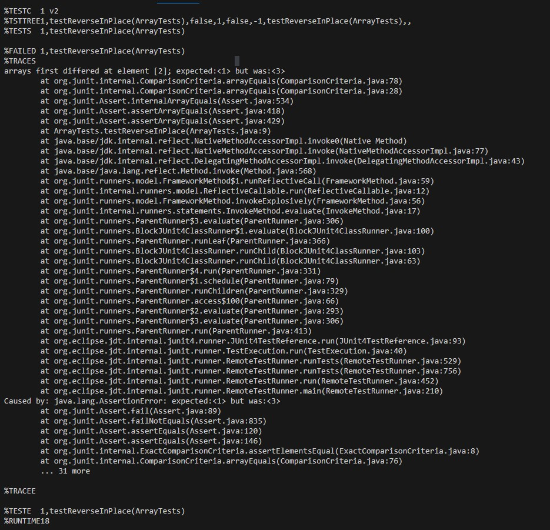
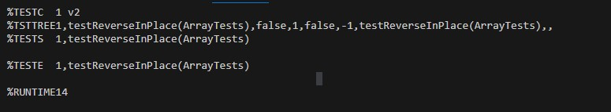

# Lab Report 3
---

Part 1
---

Failure-inducing input:
``` 
@Test 
	public void testReverseInPlace() {
    int[] input1 = { 1,2,3 };
    ArrayExamples.reverseInPlace(input1);
    assertArrayEquals(new int[]{ 1,2,3 }, input1);
	}
```

Successful input:
```
@Test 
	public void testReverseInPlace() {
    int[] input1 = { 3 };
    ArrayExamples.reverseInPlace(input1);
    assertArrayEquals(new int[]{ 3 }, input1);
	}
```
__The symptom:__  

__With the failure-inducing input__


__With the successful input:__  


__The bug:__  

__Before:__  
```
  static void reverseInPlace(int[] arr) {
    for(int i = 0; i < arr.length; i += 1) {
      arr[i] = arr[arr.length - i - 1];
    }
  }
```

__After:__  
```
static void reverseInPlace(int[] arr) {
    for(int i = 0; i < arr.length; i += 1) {
      int holder = arr[i];
      arr[i] = arr[arr.length - i - 1];
      //we need to swap 
      arr[arr.length - i - 1] = holder;
    }
  }
```

Part 2: Researching "find"
---

Source: https://man7.org/linux/man-pages/man1/find.1.html   

___"-name"___:   

![image]


